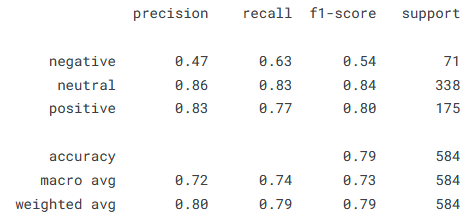
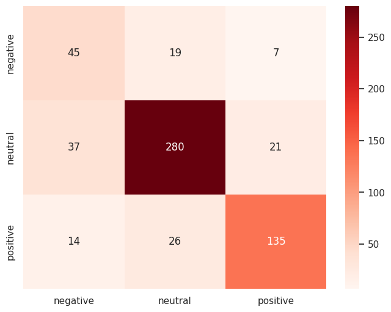

# Financial Sentiment Analysis

### Task:  
Detecting semantic orientations in economic texts. Multiclass classification distinguishing between **negative**, **neutral** and **positive** sentiment.

### Technologies used:
- Large Language Model (LLM) BERT 'bert-base-uncased' published by Google ([Paper](https://arxiv.org/abs/1810.04805))
- Fine-Tuned on financial data from FiQA and Financial PhraseBank ([Kaggle](https://www.kaggle.com/datasets/sbhatti/financial-sentiment-analysis))

### Results:

<kbd>CLICK</kbd> here, for classification report

<kbd>CLICK</kbd> here, for confusion matrix

